# <Week 2> Team Project (2024 Summer) : [PA : ShipDuck]

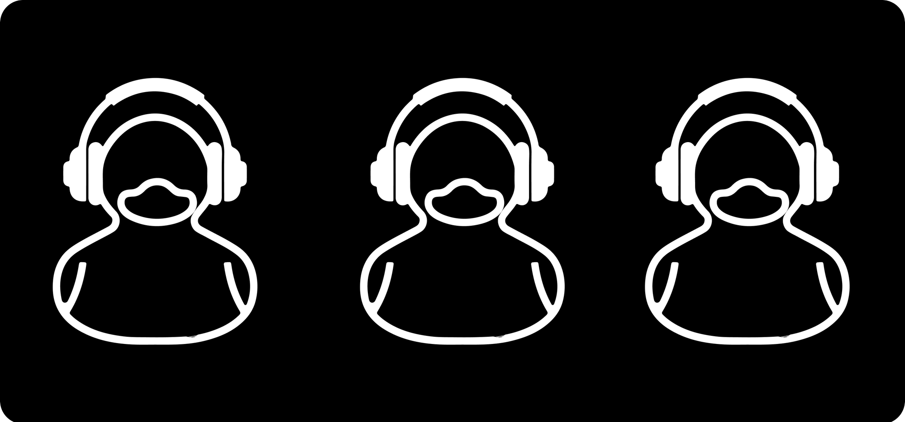

## Preview

<table>
  <tr>
    <td>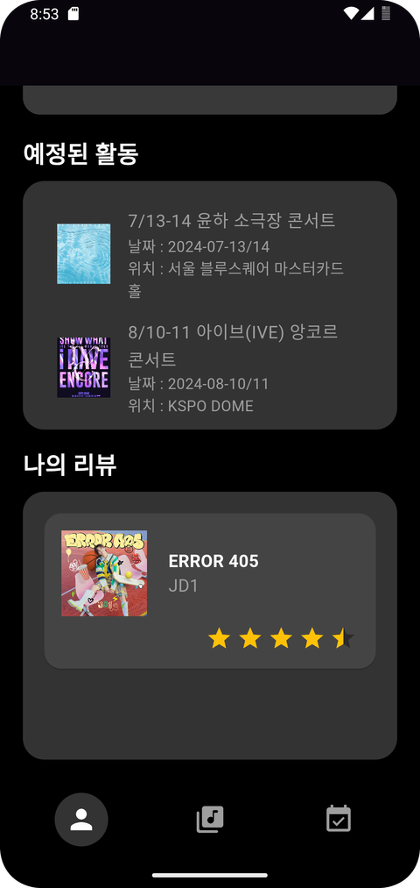</td>
    <td>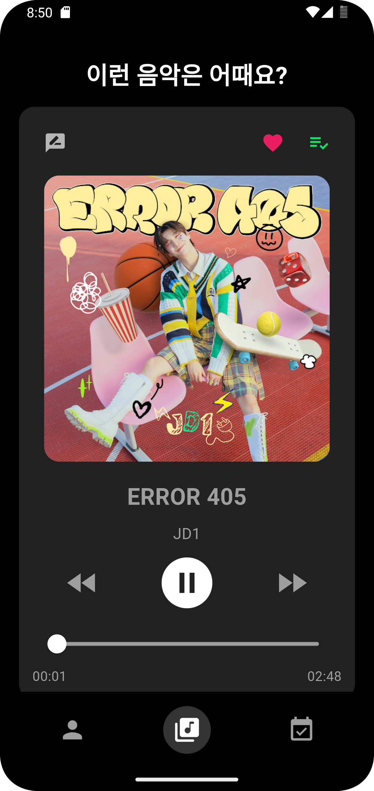</td>
    <td>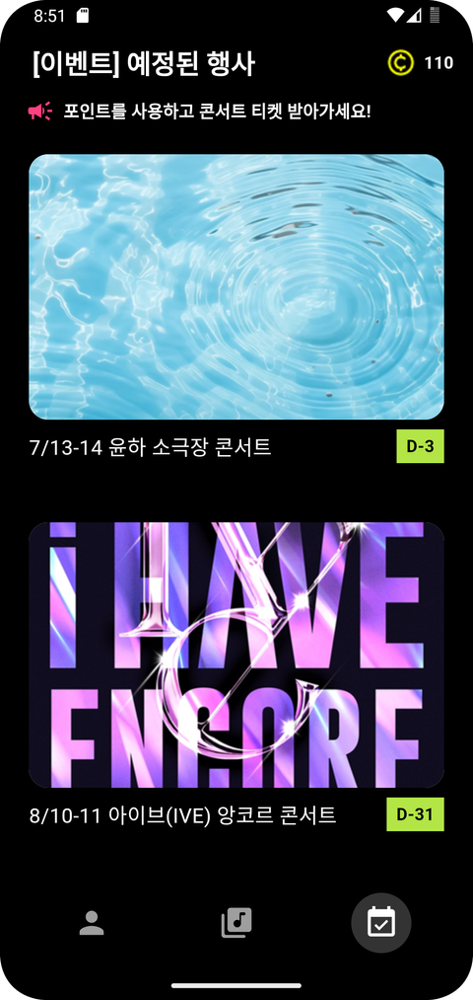</td>
  </tr>
</table>
 

## Team

1. [정인호](https://www.notion.so/madcamp/f51fae3248a747fcb3100942d2a666f9?pvs=4)
    

   [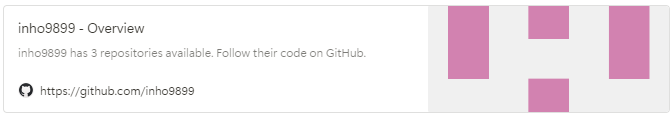](https://github.com/inho9899)
    

   BackEnd Master(호소인)

 

2. [신지원](https://www.notion.so/26ddcb3aab754914b7de5f6e740523dd?pvs=21) 
    

   [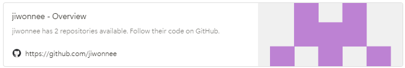](https://github.com/jiwonnee)
    
   
   FrontEnd Master (호소인)
 
 
 

## Tech Stack

- **Front-end** : Flutter
- **Back-end**: Node.js
- **Database**: MySQL
- **Server**: KCloud
- **IDE**: Android Studio & Vscode
- **Design**: Figma
- **SDK**: Kakao, Naver

 
 

## DB

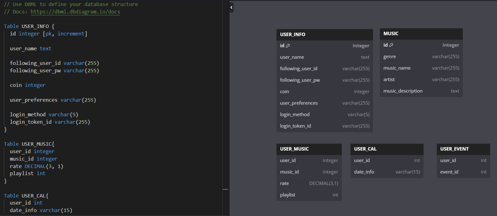

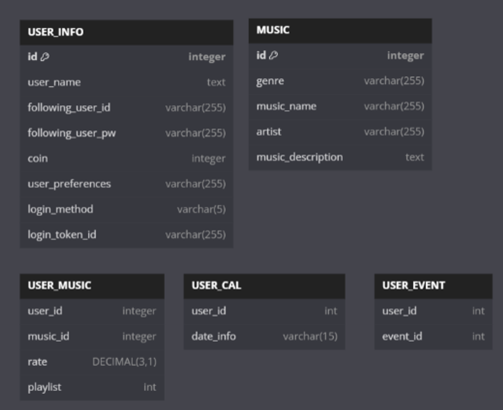

## Details
### 📱 기능 설명

### 로그인 화면

<table>
  <tr>
    <td></td>
    <td></td>
    <td>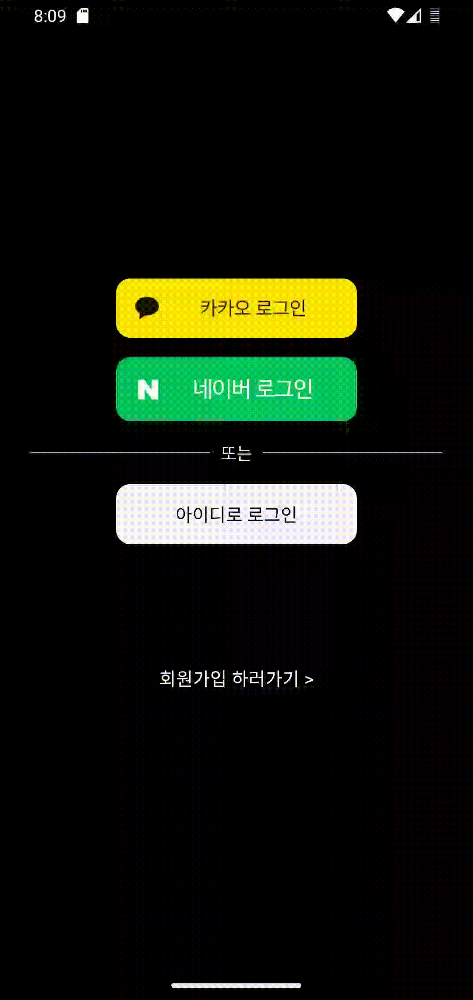</td>
  </tr>
</table>

1. 일반로그인
2. 네이버 로그인 → 회원정보 입력
3. 네이버 재로그인 → 홈스크린 연결

 

- 카카오톡, 네이버 2가지의 간편 로그인 기능

    - 초기 1회 로그인 시에만 이름, 아이디, 패스워드 입력 페이지, 음악 취향 조사 페이지 나옴
    - 그 다음 로그인 부터는 버튼 하나로 바로 로그인 가능

 

- 일반 로그인

    - 간편 로그인이 아닌 아이디, 비밀번호를 입력 하여 로그인 하는 기능
    - 정보가 없는 사용자는 하단에 로그인 불가 메세지 나옴

 

- 회원가입

    - 이름, 아이디, 비밀번호를 입력하여 초기 사용자는 회원 가입 가능
    - 정보 입력 후, 음악 취향 조사 페이지 나옴

 

- 음악 취향 조사 페이지

    - 로그인 수단(일반, 간편 로그인)에 상관 없이 최초의 회원가입 진행 시 사용자의 음악 취향 조사 진행
    - 6개의 장르 중 1개 이상을 고르면 회원가입 완료 가능 → 추후에 Tab2의 음악 추천 기능을 위한 알고리즘에 정보 전달

 

### **Tab** 1️⃣ : **전체적인 일정 관리 기능**

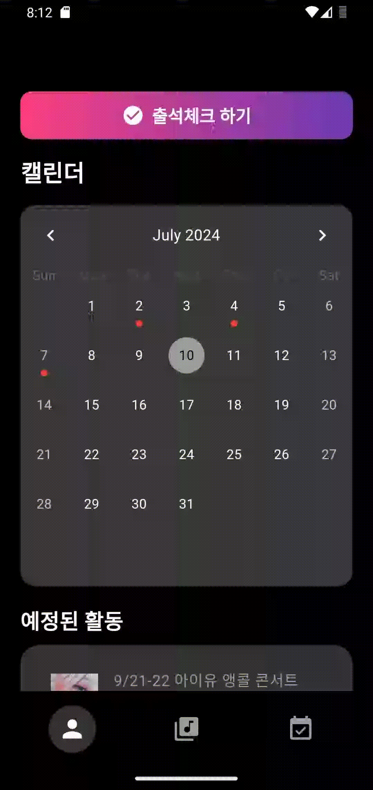

- 출석 체크 기능
    - 출석 체크로 얻은 포인트로 Tab3의 이벤트에 참여 가능
    - 캘린더에 출석 체크한 날짜 바로 반영되어 표시
    - 하루에 한 번만 출석 가능하고, 버튼을 두번 클릭 시 하단에 경고 문구 나옴
    
- 예정된 활동
    - 포인트를 사용해서 참여하게 된 이벤트 리스트업
    
- 나의 리뷰
    - Tab2 에서 추천받은 음악에 대해 별점으로 평가 한 기록 리스트업
    - 앨범 표지, 가수, 제목 정보 표시
    

### **Tab** 2️⃣ : **사용자의 데이터에 기반한 음악 추천 기능**

<table>
  <tr>
    <td></td>
    <td></td>
    <td></td>
  </tr>
</table>

1. Tab2 플레이리스트에 추가& 플레이리스트 검색 
2. Tab2 리뷰쓰기 & 나의 리뷰에 추가
3. Tab2 음악 재생

 

- 음악 추천 기능
    - 회원가입 시 진행했던 음악 취향 조사 탭 결과를 기반으로 추천 알고리즘 생성(Matrix initialization)
        - MF 알고리즘 적용, 매일 user에게 데이터 한 쌍(음악, 별점)을 제공받고 자체학습 진행
        
        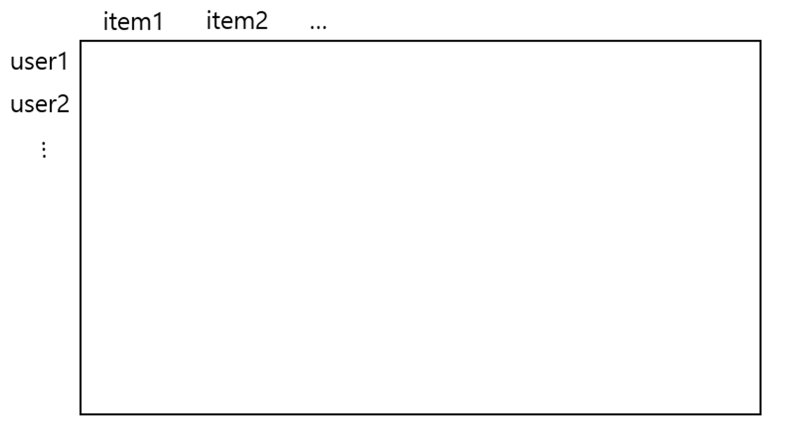
    - 총 6개의 음악 장르를 기반으로 매일 1곡씩 추천 음악 제공
    - 앨범 표지 + 제목 + 아티스트명 정보를 제공
    - 음악 재생 및 중단, 원하는 부분으로 직접 이동하여 듣기 가능
        

---

$ R := \textit{(recommend model)} $

$ R = U(\textit{User to interaction}) \times I(\textit{interaction to Item})(\textit{MF decomp.}) $

$ \textit{update R} $

- $ i := \textit{user id},\textit{    } j := \textit{music id} $

- $ \vec{p_i} := U[i, :] $, $ \vec{q_j} := U[:, j] $

- $ \hat{r_{ij}} = \vec{p_i} \cdot \vec{q_j} $, $ e_{ij} = \textit{(Rate) - } \hat{r_{ij}} $

- $ p'_{ik} = p_{ik} - \alpha \cdot \frac{\partial}{\partial p_{ik}}e^{2}_{ij} $,   $ q'_{ik} = q_{ik} - \alpha \cdot \frac{\partial}{\partial q_{ik}}e^{2}_{ij}(\textit{Gradient descent}) $

$ R_{learned} = U' \times I' $

$ R := R_{learned} $

---

- 리뷰 기능
    - 화면 왼쪽 상단의 이모티콘을 누르면 별점으로 리뷰 작성 가능
    - 리뷰를 저장하면 하단에 저장완료 문구 나옴
    - 리뷰 결과는 Tab1의 ‘나의 리뷰’ 부분에 즉시 반영
    - 리뷰 결과를 토대로 사용자의 추천 알고리즘 정교화 → 더욱 정확한 결과로 음악 추천 가능
    

- 플레이리스트에 추가 기능
    - 화면 상단의 하트 아이콘을 누르면 해당 곡을 플레이리스트에 추가 가능, 하단에 추가 완료 문구 나옴
    - 추가된 노래 목록은 화면 우측 상단의 플레이리스트 아이콘을 누르면 확인 가능
    - 플레이리스트에서는 검색 기능을 이용하여 추가한 음악 중 원하는 음악 검색 가능

### **Tab** 3️⃣ : **이벤트 및 행사 참여 기능**

<table>
  <tr>
    <td></td>
    <td></td>
    <td>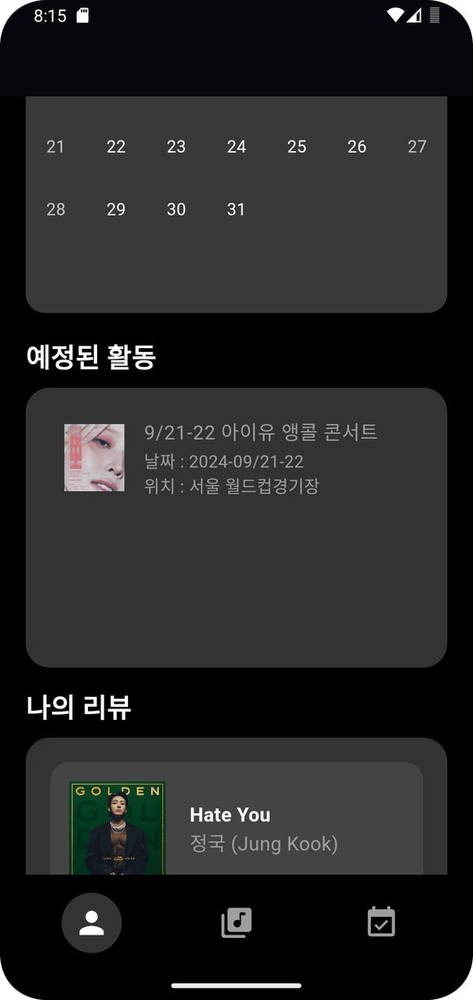</td>
    <td>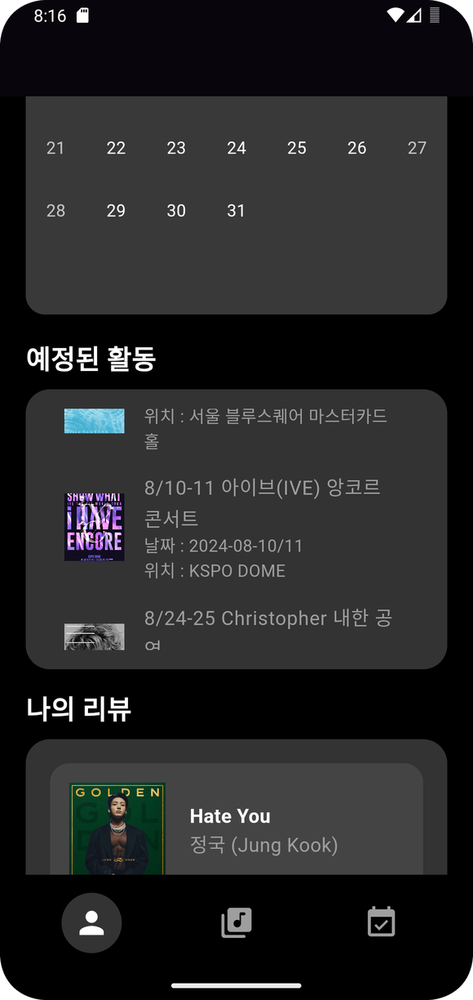</td>
  </tr>
</table>

1. Tab3 포인트 사용 전
2. Tab3 포인트 사용 & 이벤트추가
3. Tab3 이벤트 추가 전
4. Tab3 이벤트 추가 후

 

- 관리자가 업로드 한 행사에 직접 참여 할 수 있는 기능
    - 아티스트가 공식적으로 올린 행사 포스터  확인 가능
    - 현재 시간을 기준으로 행사까지 남은 기간 계산하여 디데이 제공 기능
    - 화면 상단 우측에 내가 보유한 포인트 확인 가능
    
 

- 이벤트 상세 정보
    - 포스터 클릭 시 새로운 화면에서 위치, 날짜, 아티스트 정보 제공
    - 현재 보유 포인트 및 행사 참여에 필요한 포인트 정보 제공
    - 하단의 참여하기를 누르면 Tab1의 ‘예정된 활동’ 탭에 즉시 반영, 포인트 즉시 차감 및 하단에 포인트 차감 메세지 제공
    

